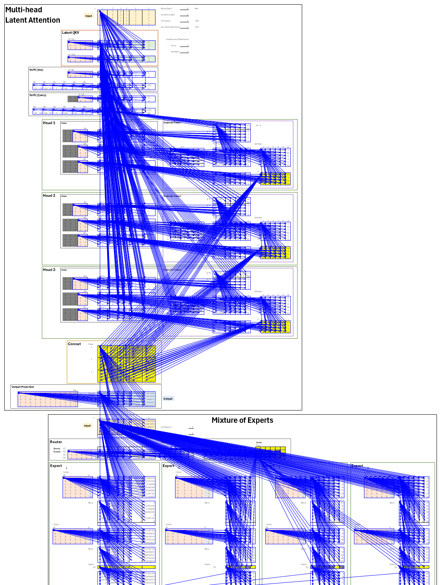

## AI By Hand - Deepseek solution

The original blank file can be downloaded from [ai-by-hand](https://github.com/ImagineAILab/ai-by-hand-excel).  
This file provides a hands-on approach to the following concepts adopted in Deepseek:

- Multi-head Latent Attention
- RoPE (Rotary Position Embedding)
- Mixture of Experts

